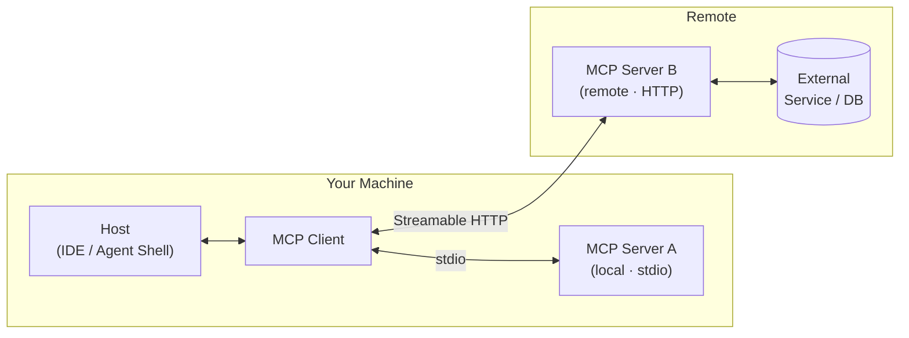

# Slide 04 – MCP Architecture

## Slide text (EN)

### Three roles – clear responsibilities

- **Host:** the AI application (IDE, agent shell, chat client)
  - Manages the LLM conversation
  - Decides which capabilities the model may use
- **MCP Client:** protocol connector embedded in the host
  - Speaks MCP to one or more servers
  - Translates server capabilities into LLM-usable function definitions
- **MCP Server:** exposes capabilities and wraps external systems
  - Implements Tools, Resources, and/or Prompts
  - Completely independent of host and model

> One host can connect to multiple MCP servers simultaneously.

---

## Speaker notes (DE)

- Die drei Rollen klar abgrenzen: Host = AI-App, Client = Protokollschicht im Host, Server = Fähigkeiten-Anbieter.
- Wichtiger Punkt: Host und Server können unabhängig voneinander entwickelt werden – das ist die Stärke des Standards.
- Diagramm erläutern: links lokal über stdio (einfach, schnell, für Entwicklung), rechts remote über HTTP (produktionstauglich, skalierbar).
- Beispiel aus der Praxis: VS Code mit GitHub Copilot ist der Host + Client. Unser StarAgent-Server ist der MCP Server.
