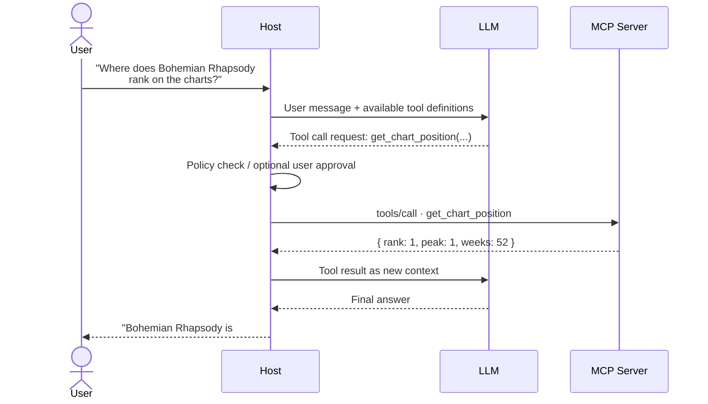

# Slide 07 – Discovery & Runtime Sequence

## Slide text (EN)

### MCP lifecycle calls (for reference)

| Phase | Call | Direction |
|---|---|---|
| Setup | `initialize` + `notifications/initialized` | Client → Server |
| Discovery | `tools/list` · `resources/list` · `prompts/list` | Client → Server |
| Invocation | `tools/call` · `resources/read` · `prompts/get` | Client → Server |

### End-to-end runtime flow

---

## Speaker notes (DE)

- Lifecycle-Tabelle nur kurz streifen: Diese Calls gibt es, der Host verwaltet sie automatisch. Man muss sie nicht selbst implementieren – das SDK erledigt das.
- Sequenzdiagramm ist das Herzstück: Hier wird sichtbar, dass der Host die Kontrolle behält. Das LLM macht einen Vorschlag (Tool Call), aber der Host entscheidet, ob er ausgeführt wird.
- Wichtige Botschaft: Der Host ist die Sicherheitsinstanz – nicht das LLM.
- Punchline zum Diagramm: Das letzte Ergebnis – „Bohemian Rhapsody ist #1 – wie immer" – ist unser Mock-Verhalten für die Demo. Kommt gleich live.
