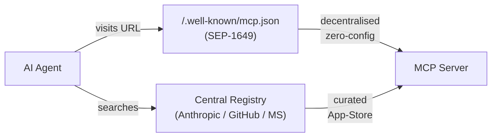

# Slide 12 – Current Developments: MCP Auto-Discovery

## Slide text (EN)

### How will AI agents find MCP servers in the future?

Two complementary approaches are emerging:

---

#### `/.well-known/mcp.json` — SEP-1649 (decentralised)

```json
{
  "mcpServers": {
    "star-agent": {
      "url": "https://yourdomain.com/mcp",
      "name": "StarAgent",
      "description": "AI tour manager for concerts and artists"
    }
  }
}
```

- An AI agent visits **any URL** and checks `/.well-known/mcp.json`
- If found: the agent autonomously discovers and uses the MCP server
- No central directory needed – like `robots.txt` or `/.well-known/openid-configuration`
- **Solves:** autonomous agent browsing and zero-config discovery

---

#### `/.well-known/mcp/server.json` — Registry approach (centralised)

```json
{
  "name": "StarAgent",
  "description": "AI tour manager for concerts and artists",
  "url": "https://yourdomain.com/mcp",
  "categories": ["entertainment", "events"]
}
```

- A website **registers** with a central MCP registry (Anthropic / GitHub / Microsoft)
- Clients search the registry – like an **App Store for MCP servers**
- **Solves:** curated discovery, trust, versioning

---

### Both are needed – they solve different problems



---

## Speaker notes (DE)

- Einordnung: Das ist Stand 2025/2026 – aktiv in Entwicklung, noch nicht überall implementiert.
- SEP-1649-Analogie: Kennt ihr `robots.txt`? Ein Agent besucht eine Website und schaut nach `/.well-known/mcp.json` – und findet damit automatisch alle MCP-Fähigkeiten dieser Domain. Kein zentrales Verzeichnis nötig.
- Registry-Analogie: Wie der App Store. Der MCP-Server meldet sich einmal an, und alle Clients können ihn über die Registry finden.
- Warum beide? SEP-1649 ist perfekt für autonome Agenten, die im Web unterwegs sind. Die Registry ist perfekt für kuratierte, vertrauenswürdige Verzeichnisse in Enterprise-Umgebungen.
- Praxishinweis: Wer heute einen MCP-Server baut, sollte `/.well-known/mcp.json` schon vorsehen – der Aufwand ist minimal, der Zukunftswert groß.
