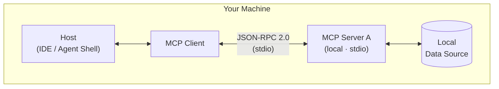
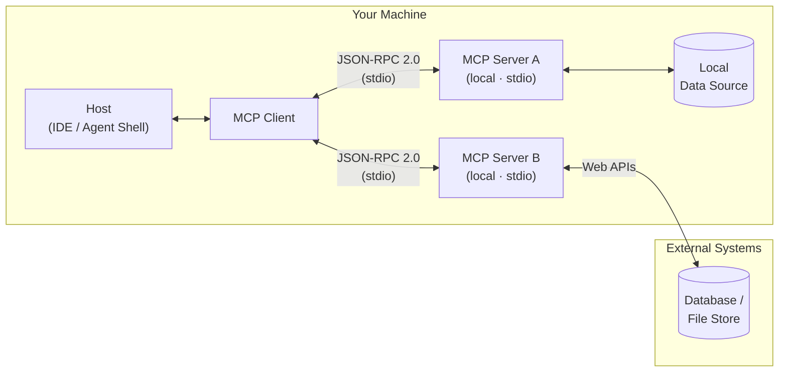
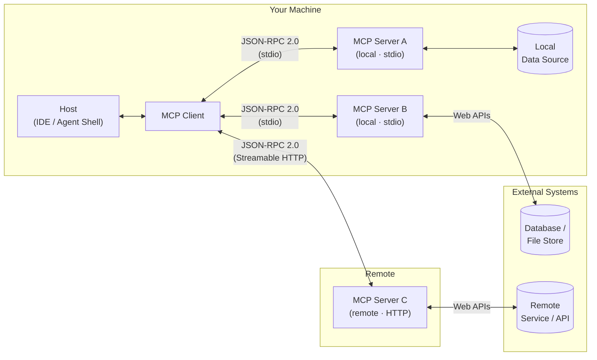
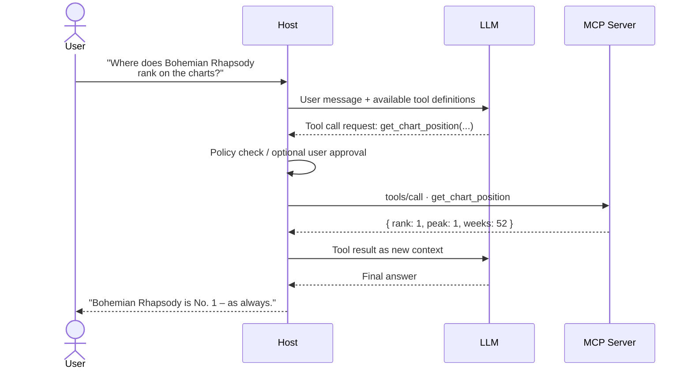
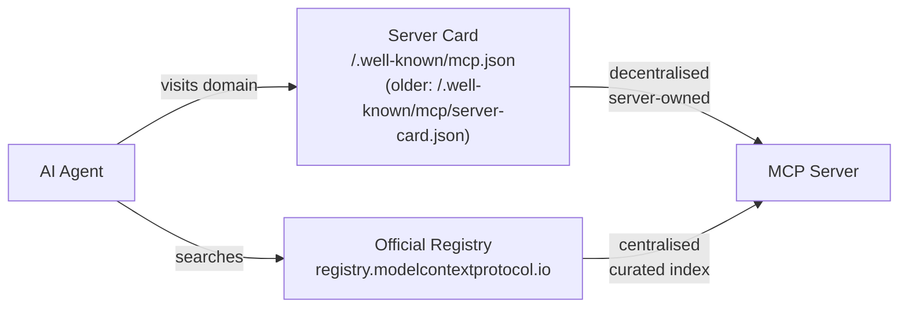

# Business<br/>Line Meeting

*The Show Must Go On.<br/>
Oberhausen. 2026.*

---
layout: cover
hideInToc: true
transition: slide-left
background: "/assets/BLMeetingBackground.png"
---

# Business<br/>Line Meeting

*The Show Must Go On.<br/>
Oberhausen. 2026.*

---
layout: intro
transition: slide-left
hideInToc: true
---

# Behind the Scenes: MCP

The Director Between AI and Enterprise Data

<!--
- Kurz die Energie des Event-Themas aufgreifen: Heute sind wir alle Stars – und **StarAgent** managed die Tour.
- Erwartung setzen: kein reiner Theorie-Vortrag. Am Ende läuft ein echter MCP-Server live.
- Ziel benennen: Jede Person hier soll danach in der Lage sein, den Kommunikationsfluss zwischen LLM und MCP zu erklären – und wissen, wie sie selbst einen Server bauen kann.
-->

---
layout: section
transition: slide-left
background: "/assets/SectionBackground.png"
hideInToc: true
---

# Denis Sowa

Architect, AI-Ambassador<br/>
BL Microsoft, Hannover

<!--
Danke an Michael Brünjes
-->

---
layout: center
transition: slide-left
class: toc
hideInToc: true
---

# _Today's Setlist_

<Toc :columns="2" :maxDepth="1" />

<!--
- Die Präsentation gliedert sich in vier Teile:
  - Was ist "MCP"
  - Wie funktioniert "MCP"
  - Wir implementieren "MCP"
  - Ausblick
- Auf GitHub gibt es zusätzliche Folien zur Verteifung.
-->

---
transition: slide-up
section: { title: "Why MCP Matters", duration: 5m }
---

# Why MCP Matters

### The world before MCP

| Problem                                   | Reality                        |
|-------------------------------------------|--------------------------------|
| Every AI integration was custom-built     | Glue code everywhere           |
| Connectors not portable across hosts      | Rewrite for each AI app        |
| No standard for security or lifecycle     | Every team reinvents the wheel |
| Maintenance cost grew with each new model | Fragile, tightly coupled       |

> MCP standardizes the contract between AI and the outside world.

<!--
- Pain Points aus dem eigenen Umfeld nennen: Wer hat schon mal einen eigenen Connector für ein LLM gebaut?
- Analogie: Vor USB gab es für jedes Gerät einen anderen Stecker. MCP ist der USB-Standard für AI-Integrationen.
- Herkunft: MCP wurde von **Anthropic** entwickelt und im **November 2024** als offener Standard veröffentlicht. Seitdem wird es von Microsoft, GitHub, Google und zahlreichen anderen Unternehmen aktiv unterstützt und weiterentwickelt.
- Kernbotschaft: MCP ist kein Framework, kein Produkt – es ist ein offenes Protokoll, das den Vertrag zwischen AI-Host und externer Fähigkeit definiert.
-->

---
transition: slide-left
zoom: 0.95
---

# Useful MCP Servers

| Server                | What it exposes                                |
|-----------------------|------------------------------------------------|
| **Context7**          | Up-to-date library docs and code examples      |
| **Microsoft Learn**   | Official Microsoft / Azure documentation       |
| **Azure DevOps**      | Work items, pipelines, repos, boards           |
| **GitHub**            | Repos, issues, pull requests, code search      |
| **Jira / Confluence** | Tickets, pages, project data                   |
| **Azure**             | Azure resources, subscriptions, deployments    |
| **Playwright**        | Browser automation and web scraping            |
| **Chrome DevTools**   | Live browser inspection, console, network, DOM |

<!--
- Hinweis: Die Verzeichnis-URLs sind später auf der Folie "Where to go next" aufgeführt.
- **Überleitung:** was genau ist dieses Protokoll?
-->

---
transition: slide-left
---

# What Is MCP

### Model Context Protocol

- **Wire protocol:** JSON-RPC 2.0 – both sides speak structured text
- **Capability model:** Tools · Resources · Resource Links · Prompts · Tasks · MCP Apps · Elicitation · Structured
  Output · OAuth 2.1 · Sampling · Streamable HTTP
- **Lifecycle management:** connection setup, capability discovery, invocation, teardown
- **Interoperability:** one server works with any MCP-compatible host
- **Transports:** `stdio` for local processes · `Streamable HTTP` for remote services

> An open standard that defines how AI applications securely and structurally connect to tools and data sources.

<!--
- MCP als Protokoll einordnen, nicht als Bibliothek oder Framework.
- JSON-RPC 2.0 hervorheben: Der MCP Client (im Host) und der Server tauschen schlicht strukturierten Text aus – dazu gleich mehr.
- Capabilities - dazu gleich mehr.
- Transport kurz erwähnen: lokal läuft es über stdio (Standard-Ein-/Ausgabe), remote über HTTP. Details kommen im Architektur-Diagramm.
- Interoperabilität betonen: ein MCP-Server in .NET funktioniert mit GitHub Copilot, Claude Desktop, VS Code und jedem anderen MCP-Host.
-->

---
transition: fade
section: { title: Architecture, duration: 6m }
---

# MCP Architecture



<!--
- Die drei Rollen klar abgrenzen:
  - Host = AI-App
  - Client = Protokollschicht im Host
  - Server = Fähigkeiten-Anbieter
- Wichtiger Punkt: Host und Server können unabhängig voneinander entwickelt werden – das ist die Stärke des Standards.
- Der Host kann mehrere Clients gleichzeitig nutzen.
- Diagramm erläutern: lokal über stdio (einfach, schnell, für Entwicklung), remote über HTTP (produktionstauglich, skalierbar).
- Beispiel aus der Praxis: VS Code mit GitHub Copilot ist der Host + Client. Unser StarAgent-Server ist der MCP Server.
-->

---
transition: fade
hideInToc: true
---

# Architecture: Multiple Servers



<!--
- Die drei Rollen klar abgrenzen:
  - Host = AI-App
  - Client = Protokollschicht im Host
  - Server = Fähigkeiten-Anbieter
- Wichtiger Punkt: Host und Server können unabhängig voneinander entwickelt werden – das ist die Stärke des Standards.
- Der Host kann mehrere Clients gleichzeitig nutzen.
- Diagramm erläutern: lokal über stdio (einfach, schnell, für Entwicklung), remote über HTTP (produktionstauglich, skalierbar).
- Beispiel aus der Praxis: VS Code mit GitHub Copilot ist der Host + Client. Unser StarAgent-Server ist der MCP Server.
-->

---
transition: slide-up
hideInToc: true
---

# Architecture: Local + Remote



<!--
- Die drei Rollen klar abgrenzen:
  - Host = AI-App
  - MCP Client = Protokollschicht im Host
  - MCP Server = Fähigkeiten-Anbieter
- Wichtiger Punkt: Host und Server können unabhängig voneinander entwickelt werden – das ist die Stärke des Standards.
- Der Host kann mehrere Clients gleichzeitig nutzen.
- Diagramm erläutern: lokal über stdio (einfach, schnell, für Entwicklung), remote über HTTP (produktionstauglich, skalierbar).
- Beispiel aus der Praxis: VS Code mit GitHub Copilot ist der Host + Client. Unser StarAgent-Server ist der MCP Server.
-->

---
transition: slide-left
hideInToc: true
---

# Architecture: Roles

### Three roles – clear responsibilities

- **Host:** the AI application (IDE, agent shell, chat client)
    - Manages the LLM conversation
    - Decides which capabilities the model may use
- **MCP Client:** protocol connector embedded in the host
    - Speaks MCP to one or more servers
    - Translates server capabilities into LLM-usable function definitions
- **MCP Server:** exposes capabilities and wraps external systems
    - Implements Tools, Resources, and/or Prompts
    - Completely independent of host and model

<!--
- Die drei Rollen klar abgrenzen:
  - Host = AI-App
  - Client = Protokollschicht im Host
  - Server = Fähigkeiten-Anbieter
-->

---
transition: slide-up
section: { title: Capabilities, duration: 4m }
---

# Capabilities

### Three primitives – plus one interaction mechanism

| Capability      | Kind                  | StarAgent example                                                |
|-----------------|-----------------------|------------------------------------------------------------------|
| **Tool**        | Server primitive      | `get_chart_position` and `book_venue` – executable operations    |
| **Resource**    | Server primitive      | `rider://artist/van-halen` – Van Halen's backstage requirements  |
| **Prompt**      | Server primitive      | `concert_press_release` – generate a dramatic tour announcement  |
| **Elicitation** | Interaction mechanism | `book_venue` can ask for missing booking details during the flow |

<!--
- Die Semantik präzise machen:
  - Tool = execute, registrierbares Primitive, kann Seiteneffekte haben
  - Resource = read, registrierbares Primitive, stabil und adressierbar
  - Prompt = template, registrierbares Primitive für wiederholbare Workflows
  - Elicitation = structured user input during a flow, Mechanismus innerhalb eines Tool-/Server-Flows, kein eigenes Demo-Primitive
- StarAgent-Beispiele direkt zeigen: Wir bauen die drei registrierbaren Kategorien live. `book_venue` zeigt zusätzlich Elicitation, wenn Buchungsdaten fehlen.
- Rider erklären: Ein Rider ist das echte Dokument, das jeder Künstler vor einem Konzert einreicht – Bühnenanforderungen, Catering, Sonderwünsche. Van Halens berühmteste Forderung: „Absolutely NO brown M&Ms.“ Das ist ein perfektes Beispiel für eine Resource – stabil, adressierbar, read-only.
- Enterprise-Brücke: Statt Rider → euer Konfigurations-Dokument, euer OpenAPI-Spec, euer Feature-Spec. Das Prinzip ist identisch.
-->

---
transition: slide-left
hideInToc: true
---

# Capabilities: Decision Guide

- **Tool** → the model needs to _do_ something or fetch dynamic data
- **Resource** → stable, readable document or data set (like a file or config)
- **Resource Links** → references that point to resources without embedding their content
- **Prompt** → standardized, repeatable workflow the model should follow
- **Tasks** → long-running or background operations that outlive a single request
- **MCP Apps** → interactive UI rendered by the host (forms, dashboards, visualizations)
- **Elicitation** → the server needs structured input from the user during a flow
- **Structured Output** → tool results must conform to a defined schema
- **Sampling** → the server needs the host's LLM to generate something (server-initiated inference)
- **OAuth 2.1** → the server requires authenticated access to protected resources
- **Streamable HTTP** → the transport needs streaming or bidirectional communication

<!--
- Das ist eine kompakte Übersicht aktueller MCP-Primitives, Features und Extensions: Stand June 2026.
- Governance-Hinweis: Die Typen haben unterschiedliche Risikoprofile (Seiteneffekte, read-only, usw.)
-->

---
transition: slide-left
zoom: 0.65
---

# MCP Feature Support Matrix

> https://mcp-availability.com

# MCP Feature Support Matrix

| Feature           | Spec Status              | Client Reality |
|-------------------|--------------------------|----------------|
| Tool              | ✅ Stable                 | ~100%          |
| Resource          | ✅ Stable                 | ~39%           |
| Resource Links    | ✅ Stable (since 06/2025) | Low            |
| Prompt            | ✅ Stable                 | ~38%           |
| Structured Output | ✅ Stable (since 06/2025) | Medium         |
| OAuth 2.1         | ✅ Stable (since 06/2025) | Medium         |
| Streamable HTTP   | ✅ Stable (since 03/2025) | High           |
| Elicitation       | ✅ Stable (since 06/2025) | ~11%           |
| Sampling          | ✅ Stable (long-standing) | ~12%           |
| Tasks             | 🔄 Extension RC          | Minimal        |
| MCP Apps          | 🔄 Extension RC          | Minimal        |

<!--
- Inzwischen wie HTML/CSS: https://mcp-availability.com
-->

---
transition: slide-up
section: { title: Runtime, duration: 3m }
---

# Runtime: Host as Translator

### The LLM never sees MCP

The **host** is the AI application (Claude Code, Warp, GitHub Copilot, …).
Its embedded **MCP client** speaks two languages: **MCP** on one side, and the **LLM's native tool format** on the
other.

```text
MCP Server (.NET)
    ↕  always: MCP / JSON-RPC 2.0
MCP Client (embedded in host)
    ↕  translated to the LLM's format:
        Claude Code / Warp  →  Anthropic Tool Use  →  injected into system prompt
        GitHub Copilot       →  OpenAI Function Calling
        Gemini               →  Google Function Calling
Host application
    ↕  conversation and policy control
LLM
```

The MCP server never knows which LLM or host application is on the other end.
One server works with every MCP-compatible host – the host handles the translation.

<!--
- Kernbotschaft deutlich machen: LLM und MCP-Server sprechen **nie direkt** miteinander. Der Host ist die AI-App und bleibt die Kontrollinstanz; der eingebettete MCP Client übernimmt die Protokollschicht.
- JSON-RPC 2.0 ist kein Hexenwerk – es sind strukturierte Textnachrichten mit `method`, `params` und `result`.
- Auf Git folgen weitere Folien, mit detalierteren Beschreibungen.
- Dann kommen wir zu: **Wir implementieren "MCP"**
-->

---
transition: slide-left
hideInToc: true
hideFor: live
---

# Lifecycle Calls

### For reference

| Phase      | Call                                             | Direction       |
|------------|--------------------------------------------------|-----------------|
| Setup      | `initialize` + `notifications/initialized`       | Client → Server |
| Discovery  | `tools/list` · `resources/list` · `prompts/list` | Client → Server |
| Invocation | `tools/call` · `resources/read` · `prompts/get`  | Client → Server |

---
zoom: 0.75
transition: slide-up
hideFor: live
---

# It's just text – structured text

### Step 1 – Host discovers tools from MCP server (JSON-RPC)

```json
{
    "jsonrpc": "2.0",
    "id": 1,
    "result": {
        "tools": [
            {
                "name": "get_chart_position",
                "description": "Returns the chart position of a song.",
                "inputSchema": {
                    "type": "object",
                    "properties": {
                        "song_title": {
                            "type": "string"
                        },
                        "artist": {
                            "type": "string"
                        },
                        "chart": {
                            "type": "string",
                            "default": "Billboard Hot 100"
                        }
                    },
                    "required": [
                        "song_title",
                        "artist"
                    ]
                }
            }
        ]
    }
}
```

<!--
- Discovery-Vorgang: Der MCP Client im Host ruft die Fähigkeiten des Servers ab und übersetzt sie in Function-Definitions für das Modell.
- Highlight: Das LLM „sieht“ nur die Tool-Schemata – es weiß nicht, ob dahinter .NET, Python oder ein Toaster steckt.
-->

---
zoom: 0.85
transition: slide-up
hideFor: live
hideInToc: true
---

# It's just text – structured text

### Step 2 – Host passes tool schema to LLM as a callable function

```json
{
    "type": "function",
    "function": {
        "name": "get_chart_position",
        "description": "Returns the chart position of a song.",
        "parameters": {
            "type": "object",
            "properties": {
                "song_title": {
                    "type": "string"
                },
                "artist": {
                    "type": "string"
                },
                "chart": {
                    "type": "string"
                }
            },
            "required": [
                "song_title",
                "artist"
            ]
        }
    }
}
```

<!--
- Highlight: Das LLM „sieht“ nur die Tool-Schemata – es weiß nicht, ob dahinter .NET, Python oder ein Toaster steckt.
-->

---
transition: slide-up
hideFor: live
hideInToc: true
---

# It's just text – structured text

### Step 3 – LLM responds with a tool call

```json
{
    "name": "get_chart_position",
    "arguments": {
        "song_title": "Bohemian Rhapsody",
        "artist": "Queen"
    }
}
```

<!--
- Das LLM entscheidet, ob es ein Tool aufrufen will – es gibt einfach JSON zurück. Keine Magie.
-->

---
transition: slide-up
hideFor: live
hideInToc: true
---

# It's just text – structured text

### Step 4 – Host sends `tools/call` to MCP server

```json
{
    "jsonrpc": "2.0",
    "id": 2,
    "method": "tools/call",
    "params": {
        "name": "get_chart_position",
        "arguments": {
            "song_title": "Bohemian Rhapsody",
            "artist": "Queen"
        }
    }
}
```

<!--
- Der Host entscheidet (Policy-Check, ggf. User-Approval); der MCP Client im Host schickt dann `tools/call` an den Server.
-->

---
transition: slide-left
hideFor: live
hideInToc: true
---

# It's just text – structured text

### Step 5 – MCP server returns result → host feeds it back to LLM

```json
{
    "jsonrpc": "2.0",
    "id": 2,
    "result": {
        "content": [
            {
                "type": "text",
                "text": "{\"rank\":1,\"peak\":1,\"weeks\":52,\"chart\":\"Billboard Hot 100\"}"
            }
        ]
    }
}
```

<!--
- Der Server antwortet dem MCP Client; der Host reicht das Ergebnis als neuen Context an das Modell weiter.
-->

---
transition: slide-up
---

# Runtime Sequence

### End-to-end flow



<!--
- Lifecycle-Tabelle nur kurz streifen: Diese Calls gibt es, der Host verwaltet sie automatisch. Man muss sie nicht selbst implementieren – **das SDK erledigt das**.
- Sequenzdiagramm ist das Herzstück: Hier wird sichtbar, dass der Host die Kontrolle behält. Das LLM macht einen Vorschlag (Tool Call), aber der Host entscheidet, ob er ausgeführt wird.
- Wichtige Botschaft: Der Host ist die Sicherheitsinstanz – nicht das LLM.
-->

---
layout: section
transition: slide-left
background: "/assets/SectionBackground.png"
zoom: 0.9
hideInToc: true
section: { title: Implementation, duration: 12m }
---

# Implementation

---
transition: slide-left
---

# .NET SDK

### Getting started

**Option A: Project template (recommended for new projects)**

```shell
dotnet new install Microsoft.McpServer.ProjectTemplates
dotnet new mcpserver -n StarAgent.McpServer
```

**Option B: Visual Studio**

- New Project → search for "MCP" → select the MCP Server template

**Option C: Add to an existing project**

```shell
dotnet add package ModelContextProtocol
```

<!--
- SDK einordnen: War gerade noch Preview-Paket. Jetzt Version 1.4 (June 2026).
- **Überleitung:** Genug geredet, wir erstellen das StarAgent Projekt.
-->

---
title: "Create Project"
transition: slide-left
layout: terminal
---

<Asciinema src="assets/casts/createproject.cast"/>

---
layout: codeeditor
transition: none
title: "Program.cs"
---

> // Program.cs
<<< @/snippets/Program.cs

<!--
- Program.cs zeigen und auf den nächsten Folien erklären.
-->

---
layout: codeeditor
transition: none
hideInToc: true
title: "Program.cs – Usings & Builder"
---

> // Program.cs
<<< @/snippets/Program.cs {1-5}

---
layout: codeeditor
transition: none
hideInToc: true
title: "Program.cs – Logging to stderr"
---

> // Program.cs
<<< @/snippets/Program.cs {7-8}

<!--
- Logging-Hinweis: Bei stdio läuft die Protokollkommunikation über stdout. Logging immer auf stderr oder in eine Datei umleiten, damit keine Lognachrichten das Protokoll stören.
-->

---
layout: codeeditor
transition: none
hideInToc: true
title: "Program.cs – MCP Services"
---

> // Program.cs
<<< @/snippets/Program.cs {10-11}

---
layout: codeeditor
transition: none
hideInToc: true
title: "Program.cs – AddMcpServer()"
---

> // Program.cs
<<< @/snippets/Program.cs {12}

<!--
- Erledigt DI
-->

---
layout: codeeditor
transition: none
hideInToc: true
title: "Program.cs – stdio Transport"
---

> // Program.cs
<<< @/snippets/Program.cs {13}

<!--
- Hier mit Stdio.
-->

---
layout: codeeditor
transition: none
hideInToc: true
title: "Program.cs – Register Capabilities"
---

> // Program.cs
<<< @/snippets/Program.cs {14-16}

<!--
- `WithToolsFromAssembly()` / `WithResourcesFromAssembly()` / `WithPromptsFromAssembly()` – alle Klassen mit den entsprechenden Attributen im Assembly werden automatisch registriert.
- `.WithToolsFromAssembly(typeof(ChartTools).Assembly)`
- `.WithTools<Tool>()` – nur eine bestimmte Klasse registrieren.
-->

---
layout: codeeditor
transition: slide-left
hideInToc: true
title: "Program.cs – Build & Run"
---

> // Program.cs
<<< @/snippets/Program.cs {18}

<!--
- **Überleitung:** Was implementieren wir in der Demo
-->

---
transition: slide-left
title: "Demo Capabilities"
---

### Demo capabilities

- Tool: `get_chart_position, book_venue`
- Resource: `rider://artist/{name}`
- Prompt: `concert_press_release`

<!--
- Drei Klassen nacheinander implementieren.
- Punchline: „Bohemian Rhapsody ist #1 – wie immer“ – ist unser Mock-Verhalten für die Demo. Kommt gleich live.
- book_venue nutzt elicitation.
-->

---
hideInToc: true
transition: slide-left
layout: terminal
title: "Project Structure"
---

<Asciinema src="assets/casts/projectstructure.cast"/>

<!--
- Kurz die Magie der Demo erklären: Ich habe da schonmal etwas vorbereitet…
- **Überleitung:** Schauen wir uns die Projektstruktur an – drei Klassen für Tools, Resources und Prompts. Alle sind komplett leer – wir füllen sie gleich live.
-->

---
layout: codeeditor
transition: slide-left
showFor: live
title: "ChartTools.cs (live)"
---

> // ChartTools.cs

<MonacoSync />
```csharp {monaco}  {height:'460px'}
using ModelContextProtocol.Server;
using StarAgent.McpServer.Shared.Models;
using StarAgent.McpServer.Shared.Services;
using System.ComponentModel;

[McpServerToolType]
public static class ChartTools
{

}

```

<!--
```

    [McpServerTool(Name = "get_chart_position")]
    [Description("Returns the chart position of a song on a given chart.")]
    public static ChartResult GetChartPosition(
        [Description("Song title")] string songTitle,
        [Description("Artist name")] string artist,
        [Description("Chart name")] string chart = "Billboard Hot 100")
    {
        return ChartDataService.Lookup(songTitle, artist, chart);
    }

```

- Attribute-Ansatz betonen: Wer .NET kennt, fühlt sich sofort zu Hause. Kein Boilerplate, kein manuelles JSON-Parsing.
- Description-Attribute sind entscheidend: Sie landen direkt im Tool-Schema, das das LLM sieht. Je klarer die Description, desto besser die Tool-Auswahl durch das Modell.
-->

---
layout: codeeditor
transition: slide-left
hideFor: live
title: "ChartTools.cs"
---

> // ChartTools.cs

<CodeBlockSync />
<<< @/snippets/ChartTools.cs {maxHeight: '440px'}

---
layout: codeeditor
transition: slide-left
showFor: live
title: "RiderResources.cs (live)"
---

> // RiderResources.cs

<MonacoSync />
```csharp {monaco}  {height:'460px'}
using ModelContextProtocol.Server;
using StarAgent.McpServer.Shared.Models;
using StarAgent.McpServer.Shared.Services;
using System.ComponentModel;

[McpServerResourceType]
public static class RiderResources
{

}

```

<!--
```
    [McpServerResource(
        UriTemplate = "rider://artist/{name}",
        Name = "artist_rider",
        MimeType = "application/json")]
    [Description("Returns the backstage rider for an artist.")]
    public static string GetRider(
        [Description("Artist slug")] string name)
    {
        return RiderDataService.Load(name);
    }
```

- **Hinweis:** MCP unterstützt Resource Subscriptions, wenn der Server sie anbietet; der Host kann dann über Änderungen benachrichtigt werden.
- Inzwischen gibt es auch Resource Links
-->

---
layout: codeeditor
transition: slide-left
hideFor: live
title: "RiderResources.cs"
---

> // RiderResources.cs

<<< @/snippets/RiderResources.cs {maxHeight: '440px'}

---
layout: codeeditor
transition: slide-left
title: "PressReleasePrompts.cs"
---

> // PressReleasePrompts.cs

<CodeBlockSync />
<<< @/snippets/PressReleasePrompts.cs {maxHeight: '440px'}

<!--
- Prompt klar von Tool abgrenzen: Der Prompt wird nicht ausgeführt und hat keine Seiteneffekte.
- Der Server liefert ein wiederverwendbares Prompt-Template als Prompt Messages zurück.
- Der Host ruft den Prompt ab und gibt die resultierenden Messages an das LLM weiter; der MCP-Server ruft das LLM nicht selbst auf.
- StarAgent-Bezug: `concert_press_release` standardisiert die Dramaturgie für die Tour-Ankündigung.
-->

---
title: Register MCP
transition: slide-left
---

# Register: stdio

### Development with stdio transport

```json
{
    "servers": {
        "StarAgent": {
            "type": "stdio",
            "command": "dotnet",
            "args": [
                "run",
                "--project",
                "<path-to-project>"
            ]
        }
    }
}
```

<!--
- Jetzt den MCP in der Konfiguration hinzufügen.
-->

---
layout: center
transition: slide-left
section: { title: Demo, duration: 7m }
---

# Demo

<!--
- **Überleitung:** Wir nutzen den MCP-Server.
- Claude erkennt MCP automatisch
-->

---
transition: slide-left
layout: terminal
hideInToc: true
title: "Demo: Tools"
---

<Asciinema src="assets/casts/mcp_tools.cast" />

<!--
- Wo steht Bohemian Rhapsody von Queen in den Charts? - Natürlich auf der #1!
- Eine Halle buchen:
    - Nur Queen und 5000 Personen angeben
    - MCP fragt nach den fehlenden Parametern (Elicitation)
    - Der Host rendert eine passenden UI (sieht jedes mal anders aus)
-->

---
transition: slide-left
layout: terminal
hideInToc: true
title: "Demo: Resources"
---

<Asciinema src="assets/casts/mcp_resources.cast" />

<!--
- Zeig mir das Backstage-Rider für Van Halen
- Rider-Punchline: Van Halen öffnen → „Absolutely NO brown M&Ms" live im Chat auftauchen lassen. 🤘
-->

---
transition: slide-left
layout: terminal
hideInToc: true
title: "Demo: Prompt"
---

<Asciinema src="assets/casts/mcp_prompt.cast" />

<!--
- **Wichtig:** Der Prompt wird vom Host ausgeführt. Das Ergebnis wird dann an das LLM übergeben. 
- /mcp__StarAgent__concert_press_release Queen Metronom_Theater_Oberhausen 26.06.2026 The_show_must_go_on!
    - Claude parst "..." und "..." nicht.
    - https://github.com/anthropics/claude-code/issues/70284
-->

---
transition: slide-left
section: { title: "Deployment Options", duration: 4m }
---

# Debugging Tip

> npx @modelcontextprotocol/inspector


<!--
- Features:
    - Resources
    - Prompts
    - Tools
- Neu:
    - Tasks
    - Apps
    - Usw.

Zu einigen Punkten (z.B. Apps) wird Lukas Beerschwinger noch einen Talk in der Brownbacksession halten.
-->

---
transition: slide-left
---

# Host-side: discover and invoke

```csharp
await using var client = await McpClient.CreateAsync(transport);

var tools  = await client.ListToolsAsync();
var result = await client.CallToolAsync("get_chart_position",
    new { songTitle = "Bohemian Rhapsody", artist = "Queen" });
```

<!--
- Das SDK kann MCP-Server auch nutzen: Host-Seite zeigen: ListToolsAsync gibt die Discovery zurück, CallToolAsync führt aus. Genau das, was wir als JSON-RPC gesehen haben – jetzt als typisierter .NET-Aufruf.
-->

---
transition: slide-left
---

# HTTP Transport: Reference

### From stdio to Streamable HTTP – minimal changes

```shell
dotnet add package ModelContextProtocol.AspNetCore
```

> // Program.cs

```csharp {monaco-diff}  {height:'280px'}
var builder = Host.CreateApplicationBuilder(args);

builder.Services
    .AddMcpServer()
    .WithStdioServerTransport()
    .WithToolsFromAssembly()
    .WithResourcesFromAssembly()
    .WithPromptsFromAssembly();

var app = builder.Build();
await app.RunAsync();
~~~
var builder = WebApplication.CreateBuilder(args);

builder.Services
    .AddMcpServer()
    .WithHttpTransport()
    .WithToolsFromAssembly()
    .WithResourcesFromAssembly()
    .WithPromptsFromAssembly();

var app = builder.Build();
app.MapMcp("/mcp");
await app.RunAsync("http://localhost:3001");
```

<!--
- Folie ist reine Referenz – kein Live-Coding hier.
- Hauptaussage: Die Tool-/Resource-/Prompt-Implementierungen bleiben 1:1 identisch. Nur `Program.cs` ändert sich.
- Auth-Hinweis: Bei HTTP-Transport ist Authentifizierung Pflicht in Produktion. Typisch: Azure AD, API-Keys oder OAuth.
-->

---
transition: slide-left
---

# Register: HTTP

### Development with HTTP transport

**Connect a host via `mcp.json`**

```json
{
    "servers": {
        "StarAgent": {
            "type": "http",
            "url": "http://localhost:3001/mcp"
        }
    }
}
```

---
transition: slide-up
---

# Azure Function: Reference

### Serverless hosting

> // Program.cs

```csharp
using Microsoft.Azure.Functions.Worker;
using Microsoft.Azure.Functions.Worker.Builder;
using Microsoft.Extensions.DependencyInjection;
using Microsoft.Extensions.Hosting;

FunctionsApplicationBuilder builder = FunctionsApplication.CreateBuilder(args);

builder.ConfigureFunctionsWebApplication();

builder.Services
       .AddApplicationInsightsTelemetryWorkerService()
       .ConfigureFunctionsApplicationInsights();

await builder.Build().RunAsync();

```

<!--
- Diese Folie zeigt bewusst nur den Azure-Functions-Host-Wrapper; die konkrete MCP-HTTP-Anbindung hängt vom verwendeten SDK-/Binding-Ansatz ab.
- Azure Functions isolated worker ist das moderne Modell (.NET 8 / .NET 10) – nicht den älteren in-process-Host verwenden.
- Die Tool-/Resource-/Prompt-Klassen bleiben identisch zu stdio und ASP.NET Core – nur der Host-Wrapper ändert sich.
- `McpServerHttpHandler` beziehungsweise die jeweilige Trigger-/Handler-API übersetzt HTTP-Request/-Response in das MCP-Protokoll. Exakte API-Namen vor dem Event gegen SDK-Version und Demo-Repo prüfen.
- Stateless-Transport-Hinweis: Azure Functions sind zustandslos. Damit ist kein Sampling möglich.
- Produktionsrelevanz: Viele Enterprise-Teams, die bereits Functions nutzen, können so MCP-Fähigkeiten mit minimaler Infrastruktur exposieren.
- Auth: Function-Keys für einfache Szenarien, Azure AD für Unternehmensumgebungen.
-->

---
transition: slide-left
hideInToc: true
---

# Azure Function

> // McpToolFunctions.cs

```csharp
[Function(nameof(GetChartPosition))]
public ChartResult GetChartPosition([McpToolTrigger("get_chart_position", "Returns the chart position of a song on a given chart.")] ToolInvocationContext context,
                                    [McpToolProperty("songTitle", "Song title", true)] string songTitle,
                                    [McpToolProperty("artist", "Artist name", true)] string artist,
                                    [McpToolProperty("chart", "Chart name")] string? chart)
{
    string resolvedChart = string.IsNullOrWhiteSpace(chart)
        ? "Billboard Hot 100"
        : chart;

    return ChartDataService.Lookup(songTitle, artist, resolvedChart);
}
```

---
layout: section
transition: slide-left
background: "/assets/SectionBackground.png"
hideInToc: true
section: { title: Outlook, duration: 5m }
---

# Outlook

---
transition: slide-up
zoom: 0.88
---

# Auto-Discovery

### Server Cards — SEP-2127 (formerly SEP-1649, draft)

```json
{
    "protocolVersion": "2025-06-18",
    "serverInfo": {
        "name": "star-agent",
        "title": "StarAgent",
        "version": "1.0.0"
    },
    "description": "AI tour manager for concerts and artists",
    "transport": {
        "type": "streamable-http",
        "endpoint": "https://yourdomain.com/mcp"
    }
}
```

| Model                         | Where                                                               | Purpose                  |
|-------------------------------|---------------------------------------------------------------------|--------------------------|
| **Decentralised Server Card** | `/.well-known/mcp.json` · older `/.well-known/mcp/server-card.json` | Server-owned discovery   |
| **Official Registry**         | `registry.modelcontextprotocol.io`                                  | Curated searchable index |

<!--
- Einordnung: SEP-2127, ehemals SEP-1649, ist weiterhin Draft und noch nicht Teil des Core-Protokolls.
- Wichtig: Beide well-known-Pfade beschreiben denselben dezentralen Server-Card-Ansatz. Der ältere Draft-Pfad heißt `/.well-known/mcp/server-card.json`, nicht `server.json`.
- Analogie: Kennt ihr `robots.txt`? Ein Agent besucht eine Website und schaut nach `/.well-known/mcp.json` – und findet damit automatisch, wo der MCP-Server dieser Domain erreichbar ist.
- Registry-Analogie: Wie ein App Store. Der MCP-Server wird zentral gelistet, damit Clients und Menschen ihn suchen und kuratiert bewerten können.
- Praxis-Hinweis: Wer heute vorbereitet sein will, plant `/.well-known/mcp.json` ein und kann optional den älteren `server-card.json`-Pfad als Alias bereitstellen.
-->

---
transition: slide-up
---

# Discovery Models



<!--
- Praxishinweis: Server Cards und Registry ergänzen sich. Die Website liefert die autoritative Selbstbeschreibung, die Registry liefert Auffindbarkeit.
-->

---
transition: slide-left
hideInToc: true
title: "MCP Ecosystem"
---

> https://modelcontextprotocol.io/registry


---
transition: slide-left
---

# A2UI - A Protocol for Agent-Driven Interfaces

> https://a2ui.org

**Problem:** How can AI agents safely send rich UIs across trust boundaries?

**Solution:** Agents send declarative JSON → clients render with native widgets

```json
  {
    "type": "button",
    "label": "Search",
    "onTap": {
        "actionId": "search"
    }
}
```

- **Secure** — declarative data, not code; only pre-approved components
- **LLM-friendly** — easy to generate, stream, and update
- **Framework-agnostic** — same payload for Angular, Flutter, React, …
- **MCP-ready** — delivers UI via tool responses and resources

<!--
- A2UI ist von Google gestartet, Apache 2.0, mit Contributions von CopilotKit.
- A2UI ist kein MCP-Core-Feature, sondern ein ergänzender UI-Ansatz für agentengetriebene Interfaces.
- MCP-ready bedeutet hier: Solche UI-Payloads können über Tool Responses oder Resources transportiert werden, aber MCP selbst definiert nicht den UI-Komponentenkatalog.
- Wichtig: Der Agent darf nur Komponenten aus einem vorab definierten Katalog verwenden – keine UI-Injection. **button** ist eine von vielen Komponenten aus einem Katalog,
- Beispiel: Agent schickt JSON mit "text-field" und "button" – der Client rendert das mit seinen eigenen nativen Widgets.
- Transport ist flexibel: A2A, AG-UI, oder jedes andere Protokoll das JSON tragen kann.
- Use Cases: Dynamische Formulare, Remote Sub-Agenten die UI zurückliefern, adaptive Dashboards.
- MIME-Type: application/a2ui+json
-->

---
transition: slide-left
---

# Key Takeaways

- **MCP standardizes AI-to-system integration** – one protocol, any host, any model
- **Capabilities & features:** `Tool` · `Resource` · `Prompt` · `Tasks` · `Elicitation` · `Structured Output` ·
  `Resource Links` · `OAuth 2.1` · `Sampling` · `Streamable HTTP`
- **The host is the control layer** – the LLM proposes, the host decides
- **Transport is a deployment decision** – stdio locally, HTTP remotely, Functions serverlessly
- **Auto-discovery is emerging** – server cards via `/.well-known/mcp.json`, plus central registries
- **UI is coming** – `a2ui.org`
- **Start small:** one tool · one server · connect to your host

<!--
- Kernbotschaften nochmal kurz zusammenfassen – nicht vorlesen, sondern in eigenen Worten.
- Wichtigste Botschaft für Entwickelnde: Es ist weniger Aufwand als gedacht. Attribute drauf, DI fertig, Server läuft.
- Wichtigste Botschaft für Nichtentwickelnde: MCP schafft eine klare, auditierbare Grenze zwischen dem LLM und euren Systemen. Das ist gut für Governance und Sicherheit.
-->

---
transition: slide-left
zoom: 0.95
---

# Where to go next

| Resource                          | Link                                                         |
|-----------------------------------|--------------------------------------------------------------|
| Awesome MCP servers               | `github.com/punkpeye/awesome-mcp-servers`                    |
| Official MCP Registry (preview)   | `modelcontextprotocol.io/registry`                           |
| Community MCP Directory (curated) | `mcp.directory/awesome-mcp-servers`                          |
| MCP specification                 | `modelcontextprotocol.io/specification`                      |
| .NET SDK quickstart               | `learn.microsoft.com/dotnet/ai/get-started-mcp`              |
| Build a minimal server            | `learn.microsoft.com/dotnet/ai/quickstarts/build-mcp-server` |
| NuGet package                     | `nuget.org/packages/ModelContextProtocol`                    |

<!--
- **Überleitung:** Q&A öffnen.
-->

---
layout: section
transition: slide-left
background: "/assets/SectionBackground.png"
hideInToc: true
section: { title: "Q&A", duration: 11m, buffer: true }
---

# Q&A

---
transition: slide-up
hideInToc: true
title: "Thank you"
layout: cover
background: "/assets/BLMeetingBackground.png"
section: { title: "Bye", duration: 1m }
---

<animated-text text-8xl text-primary text="Thank you!" />


<!--
- Demo-Repo oder Slides-Link zum Nachschlagen kommunizieren.
-->

---
zoom: 1.7
layout: terminal
hideFor: live
title: "Bonus"
---

<Asciinema src="assets/casts/sw.cast"/>
